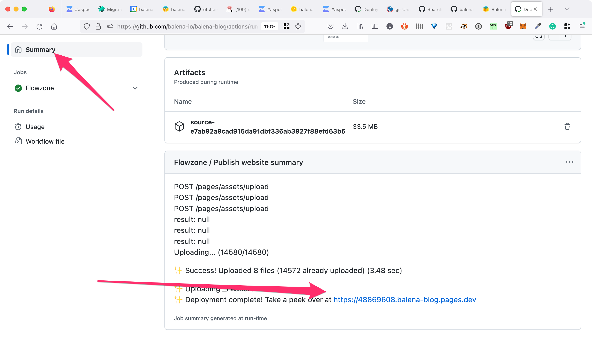

# DocuBuilder: Deploy Docusaurus Websites at Scale

> The `create-react-app` way of building and deploying docusaurus websites

This is the official Docusaurus theme for balena docs.
[Docusaurus 2](https://docusaurus.io/) is a modern static website generator that we used to generate docs.
This repository hosts a customized docusarus theme and a docusaurus builder GitHub action.

The GitHub action parses, prepares and generates documentation when running on a GitHub repository.
The website that is built by the builder is automatically deployed on Cloudflare Pages for previews.


## Getting Started

### I have docs, I need a website

Let jump straight into building your first website.

1. Create a new Cloudflare Pages project by using the `direct upload` option or if you do not have access please ask ops / admins to do it for you
2. Decide a project name. If available on Cloudflare, then this will be your URL: `project-name.pages.dev`
3. Once that is complete, make this API call to change the project's default branch to master or main or whatever your GitHub project uses

```bash
curl -X PATCH "https://api.cloudflare.com/client/v4/accounts/$CF_ACCOUNT_ID/pages/projects/project-name"   -H "Authorization: Bearer $CF_API_KEY"      -H "Content-Type: application/json"      --data ' {"production_branch": "$GITHUB_BRANCH","production_deployments_enabled": true}' -v
```

4. In your exisitng `flowzone.yml` file, add a `cloudflare_website` variable in the `with:` section with the value of the variable being the Cloudflare project name you decided

```yml
name: Flowzone

on:
  pull_request:
    types: [opened, synchronize, closed]
    branches:
      - "main"
      - "master"

jobs:
  flowzone:
    name: Flowzone
    uses: product-os/flowzone/.github/workflows/flowzone.yml@master
    secrets: inherit
    with:
       cloudflare_website: "CLOUDFLARE_PROJECT_NAME"
```

And, you are done!
Make a pull request and you should see the docusaurus action running as part of your Flowzone steps.


### What did I just do?

1. You created a new project on Cloudflare Pages to deploy your docs website on. It's exactly like GitHub pages but better
2. You then did some configuration to get Cloudflare Pages automated correctly. Or atleast someone did it for you
3. You configured the docusaurus builder with the required inputs to start building on your repository
4. If everything went well, then a preview URL will appear in the Flowzone run summary which you can use to view your docs website

This is no magic, only hard automation.
You just deployed a docusaurus website on Cloudflare Pages.
To learn more about docusaurus, go through their [docs](https://docusaurus.io/docs/category/guides) and make use of [powerful features](https://docusaurus.io/docs/markdown-features) available to document better.

### I got a website, how do I make it better?

We believe in maximum input that can be infered directly from source.
Hence to enable you in building docs, we need no configuration.
The docusaurus theme GitHub action infers information from your repository with sensible defaults.
Here's some of the things the builder looks out for:

#### Pre-requistes for running the GitHub action on Flowzone

1. A README file in the root of the repository
2. An input named as `cloudflare_website` in the flowzone.yml file

#### Make your website better

1. Markdown docs present in either a docs directory called `docs` or `balena-docs`
2. [Assets/images/files](https://docusaurus.io/docs/markdown-features/assets) being used in the docs being present inside the docs directory as mentioned in point 1 referenced using [markdown links](https://docusaurus.io/docs/markdown-features/links)
3. A favicon file present in the root named as `favicon.ico`
4. A logo file present in the root named as `logo.png`
5. If you would like to override the default values for the website title and tagline, place the following snipper of `frontmatter` code at the top of your root `README.md`

```bash
---
project_name: Your website name
tagline: You website tagline
---
```

This list is exhaustive.
Will contine to add to it.
Docs are constantly evolving, but always degrading.
A little attention to detail will be neeed.

## Developing your site locally

To develop your site locally you should to have the following installed:

- [`Docker`](https://docs.docker.com/get-docker/)

Check that it is installed with the following command:

```bash
docker -v
```

With `Docker` installed, open a shell in your terminal, navigate to the root of your project's repo and run the following command:

```bash
docker run --rm -it -e "DEV=true" -v $(pwd):/app/dev -p 80:80 ghcr.io/product-os/docusaurus-builder:latest
```

> Note - if you are trying to run this from Windows, please use powershell due to the availability of the $(pwd) command

Once you see a success message in your terminal, your docusaurus site will be available to your web browser at [http://localhost:80](http://localhost:80).
Be aware due limitations, features such as `hot-reloading` are no available and you will need to exit and re-run the `docker run ...` command generate a new site and view additional changes.

To end and exit the session use `ctrl-c`.

## Finding Preview Links

Cloudflare Pages lets us create preview releases for each open pull request. To find the link, check out the action run for your pull request and click `Summary` as show below. On scrolling down, you fill find the summary containing the deploy logs from Cloudflare and if there is no error, you will find the Cloudflare Pages website link as well for your preview. 



You can find the link on the Flowzone run's Summary page or in the logs for the GitHub task `Deploy to Cloudflare`. 

## How to unpublish a Docusaurus website

To safely unpublish a docusaurus website, we need to undo or stop the steps taken by Flowzone to publish the Cloudflare Pages website. This can be done by following the steps below:

1. Create a pull request to amend `flowzone.yml` file. Delete the `cloudflare_website` property. Once the pull request is merged, the GitHub action will stop running and the website will not be updated on Cloudflare Pages. 
2. To remove the content from Cloudflare Pages, please navigate to `Cloudflare Pages & Workers` page and delete the project from the Cloudflare Pages dashboard.
3. On removing the entry, Cloudflare will prompt you to also delete the DNS entry for the Cloudflare Page. Please confirm the deletion of the DNS entry as well.
4. To prevent squatting on the Cloudflare Page, please create a new empty project of the same name to reclaim that domian. This will also help in preventing any future conflicts with the same domain name.
5. (Optional) If needed, redirect the DNS entry to back to [balena.io](balena.io) or a new target to not lose the traffic or break the user experience. If you need help with this, please reach out to the ops team.

## Contributing 

Refer to the offical [docusaurus documentation](https://docusaurus.io/) on exploring features and adding them to the docusaurus configuration here. To test your changes, the development docker image needs to be rebuilt. Use the following commands to initiate a fresh build of the docker image and create a container using that image. 

```
docker build . -t docs:latest
docker run --rm -it -e "DEV=true" -v $(pwd):/app/dev -p 80:80 docs:latest
```
