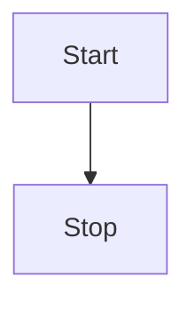

# Inital Setup 

Docusaurus-builder requires no configuration. This is facillitated by restructing docs in the repository in an opinionated, natural way for us to gain information about your project easily. Here are the few inputs we derive from your repository & it's file structure. 

## Logo & Favicon 

If there is a file called, `logo.png` in the root. We parse it to use as the logo of the docs.  
If there is a file called, `favicon.ico` in the root. We use it as the favicon for the docs.  
Defaults can be found in `static/img` directory of this repository. 

## Title 

By default, the repository name is what the docs are called on the top left as well as anywhere else is needed. 
To change this, specify the following field in your README.md frontmatter to change the title of your docs website. 

```
---
project_name: <NEW-TITLE>
---
```

## Docs Source Directory

Markdown files are used to render docs in Docusaurus. For the docusaurus-builder to find your docs, you can have the docs stored in a root level directory with the following name: 

1. `balena-docs` 
2. `docs`

Where, `balena-docs` is given higher priority if both directories exist. You can store your docs anyway you like, use any docusaurus features/plugins you intend to, refer any assets using relative links. 

## Assets & Docs Images

Images used in the documentation need to be stored in a directory inside the Docs Source Directory. The name of the images directory can be user selected and all markdown image links should have a relative path when referring assets from this directory. 

HTML image tags doesn't work and images are responsive by default. 

## Readme.md

A readme file is required to build a website using docusaurus-builder. Readme files are the first/index page of your documentation website by default. By default, the root level Readme is used to build the docs. 

If you intend to create a custom homepage for your docs, then create a `README.md` file in your Docs Source Directory for it to override your root level Readme during the docusaurus build process.

Asset links don't need to be fixed for README files. Docusaurus-builder automatically creates relative links for any assets or images referenced in the README to make sure the images render both on GitHub as a README and in the docs. 

## Mermaid Diagram

To add a Mermaid diagram 



## Footer, Header and theme

Docs components like header, footer etc. are centrally configured from this repository and the settings can be tweaked for all deployed docusaurus websites from one repository. 


